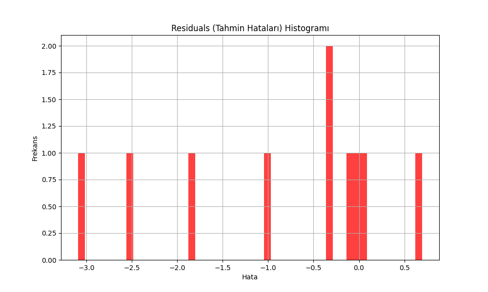

# PyTorch Forecasting with Temporal Fusion Transformer (TFT)

This repository contains a time series forecasting project utilizing PyTorch Forecasting's Temporal Fusion Transformer (TFT) model. The goal of this project is to predict environmental metrics based on the UCI Air Quality dataset.

## Table of Contents
- [Introduction](#introduction)
- [Dataset](#dataset)
- [Model](#model)
- [Results](#results)
- [Visualizations](#visualizations)
- [Planned Improvements](#planned-improvements)
- [How to Run the Project](#how-to-run-the-project)
- [Conclusion](#conclusion)

## Introduction
Temporal Fusion Transformer (TFT) is a powerful architecture designed for multi-horizon time series forecasting. This project aims to explore the usage of TFT in predicting various environmental variables, especially the concentration of CO in the air, based on other available features.

## Dataset
The dataset used is the **Air Quality UCI** dataset from UCI's Machine Learning Repository. It contains features such as:
- `CO_GT`: Ground Truth for CO concentrations (target)
- `Temperature`
- `Humidity`
- `Pressure`
- `Wind Speed`
- `NOx Concentration`
- and several other environmental variables.

### Data Preprocessing
The data underwent preprocessing steps such as:
1. Handling missing values.
2. Feature scaling and transformation.
3. Train-test split for model validation.

Data files included in this repository:
- **data/AirQualityUCI.csv**: Original dataset in CSV format.
- **data/AirQualityUCI.xlsx**: Original dataset in Excel format.

## Model
The **Temporal Fusion Transformer (TFT)** model was employed for time series forecasting. This architecture allows for:
- Attention mechanisms across time steps.
- Modeling of both static and time-varying covariates.
- Multi-horizon predictions.

The model is trained using PyTorch Lightning for efficient experiment management and scaling.

### Key Model Hyperparameters:
- **Learning Rate**: 0.001
- **Batch Size**: 64
- **Epochs**: 100
- **Gradient Clipping**: 0.1

The model can be found in the repository under `notebooks/model_results/tft_final_model.pth`.

## Results
The model currently yields the following performance metrics:

### Metrics:
- **Mean Absolute Error (MAE)**: 0.9946
- **Mean Squared Error (MSE)**: 2.1120
- **Root Mean Squared Error (RMSE)**: 1.4533
- **R² Score**: Not yet ideal (requires further tuning).

These metrics indicate that there is room for improvement, especially in model tuning and additional feature engineering.

## Visualizations
The following visualizations provide insights into the model's performance:

### Predictions vs Actual Values:


This scatter plot compares the predicted CO concentrations against the actual values in the test set.

### Residuals Histogram:


The residuals histogram helps visualize the distribution of prediction errors.

## Planned Improvements
Here are the next steps to further enhance the model’s accuracy:
1. **Hyperparameter Tuning**: Adjust learning rates, batch sizes, and dropout values.
2. **Experiment with Different Models**: Explore models like LSTMs, GRUs, or other Transformer-based architectures.
3. **Feature Engineering**: Introduce more relevant lag features and interactions between covariates.
4. **More Data**: Incorporate additional datasets to increase the robustness of predictions.

## How to Run the Project

### Prerequisites
Ensure you have the following installed:
- Python 3.7+
- PyTorch
- PyTorch Forecasting
- PyTorch Lightning

### Installation
To set up the project, clone this repository and install the required dependencies:

```bash
git clone https://github.com/egemenozen1/pytorch-forecasting-tft.git
cd pytorch-forecasting-tft
pip install -r requirements.txt

## Running the Model To run the model, you have two main options:

**Executing the Jupyter Notebook**:

You can open the main analysis notebook and run the cells step by step for data exploration, training, and evaluation.

```bash jupyter notebook notebooks/analysis.ipynb

``` Running the Model via Pre-trained Weights: Alternatively, if you want to quickly test the pre-trained model, you can run the analysis script using the saved model weights.

```bash python src/analysis.py ```

## Folder Structure The project follows a clear and structured format to make navigation easy: -

**data/**: Contains the dataset files used for training and validation, such as AirQualityUCI.csv. -

**notebooks/**: Includes Jupyter notebooks for data exploration, training the model, and result evaluation. -

**src/**: Python scripts for model development and inference. -

**README.md**: Project documentation explaining the model, dataset, and how to run the code.

## Conclusion

This project showcases the Temporal Fusion Transformer (TFT) model applied to time series forecasting on environmental data.
Although the results show potential, further improvements can be made through feature engineering, hyperparameter tuning, and experimenting with additional datasets.
For any feedback, questions, or collaboration opportunities, feel free to open an issue or contribute by submitting a pull request to improve this project!

